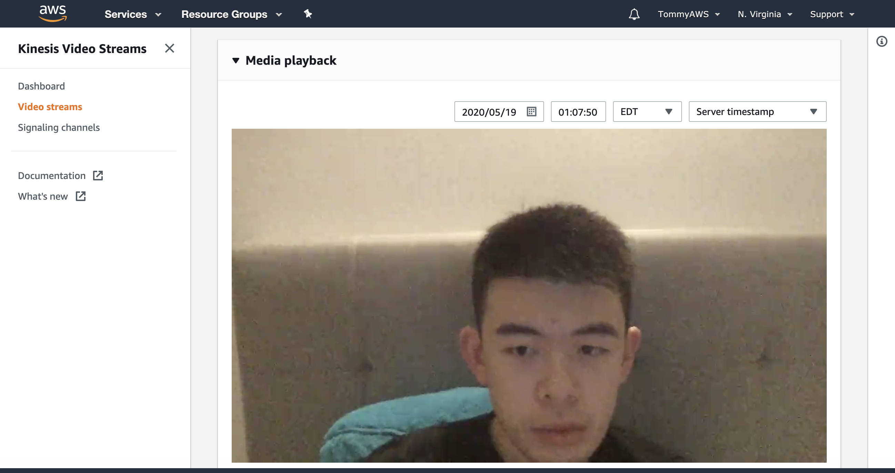
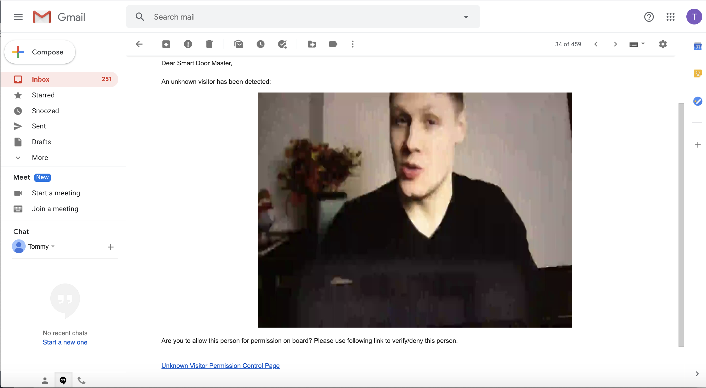

# Smart Door Authentication System

### Architecture Diagram


<br/><br/>

### Introduction

This project utilizes two key AWS features: **AWS Kinesis Video Streams Services** and **Amazon Rekognition** to build a distributed system that authenticates people and provides them with access to a virtual door.

<br/><br/>

### Use Cases

1. For every known face detected by **Rekognition** (known visitors who come in front of the webcam camera), the authentication system shall send the visitor an **SMS** message to the phone number on file.

    The text message should include a PIN or a One-Time Passcode (**OTP**) that they can use to open the virtual door. This OTP shall only be valid within 5 minutes counting on from the moment the OTP is generated. 

2. For every unknown face detected by Rekogniton (visitors who come in front of the webcame camera but recognized as someone who haven't been registered before), the authenticatio system shall send an **email** notification to the Smart Door Owner, aka, Me, with a **photo** of the visitor. 

    The email message should also include a **link** to approve access for the visitor (of course, if I want, otherwise I can deny visitor's access. Once denied, system will send a SMS message with deny to the visitor).

<br/><br/>

### Use Cases walk through/Examples with detials

When a visitor appears in front of the camera **alive** (the following snapshot represents how my face is presented in the webcame via **GStreamer** to **AWS Kinesis Video Stream**), the authentication system will capture and generates an event that triggers my **AWS Lambda function**.  


<br/><br/>

This **AWS Lambda funtion** is generated via the process of **AWS Kinesis Video Stream (KVS) -> AWS Rekognition -> AWS Kinesis Data Stream (KDS) -> Lambda**. It isimplemented to match, compare and spawn other events according to whether the visitors' information are on file.


<br/><br/>

In this case, suppose my authentication system doesn't have any visitor on file yet 👇


<br/><br/>

Then this inevitably means I have not been authenticated by my Virtual Door System yet, so my **AWS Lambda Function** will receives from the Data Stream stating my face with no match against the database, after my facial information was analyzed by **AWS Rekogtion** and generated to **KDS**. 


<br/><br/>

Hence, an email will be sent to the **Smart Door Owner** (in this case it's me, as both the owner and visitor just to simplify the process). The mail contains the information of the visitor with a captured picture of the visitor's face and a link for the owner to decide whether to grant access or not. Again, all these **event-driven** activities are implemented in my **AWS Lambda Function**. 

Since all the services are deployed onto AWS, hence **Serverless**


<br/><br/>

Once the owner (me) grants the access to the visitor with the visitor's name and phone, this will be put on file to **Dynamo DB**. The stored information also contains a list of photos of the visitors on file, indexed and put into **AWS S3 Bucket**

```
Name: Tommy Tang
Phone: 4143341784
Photos: a list of photos that collects all the facial pictures stored on AWS S3
```


<br/><br/>

Once the owner grants the access through the frontend webpage 👆, it triggers another event implemented by another **AWS Lambda Function**. This function generates an one-time-passcode (**OTP**) with 5 minutes timestamp, and store it onto **DynamoDB** 


<br/><br/>

**DynamoDB** table for visitor's *name*, *phone number*, and a list of *photos* stored on **AWS S3 Bucket**


<br/>


<br/><br/>

Meanwhile, **AWS Rekogtion** is triggered by the **AWS Lambda Function** to record the visitor's (my) facial information in the collection I named **"faces"**.

From now on, any time a granted face of the same person is recoreded, the collection appends another face informatino under the index for the same person/visitor.


<br/><br/>

Also, another triggered event is that the **AWS Lambda Function** will send out the **OTP** to the visitor's registered cell phone number via **AWS SNS Services**. 


<br/><br/>

From the visitor's end, the visitor shall receive something like this 👇


<br/><br/>

With the OTP, the visitor can then use the link provided in the SMS text message 👆to go into another frontend webpage for the visitor entrance.


<br/><br/>

WIth such OTP within the first 5 minutes the OTP is generated, the visitor is able to enter the Smart Door without the need to ask for permissions from the smart door owner again.


<br/><br/>

Later when the same visitor (for example, me again) comes in front of the smart door, the authentication system will capture the visitor's face **alive** from the webcam again via **AWS Kinesis Video Stream** automatically. Since my face has been recognized before, **AWS Rekognition** shall have my information recorded, and thus append another photo of me selected from 1 frame in the streamed video alive.



<br/><br/>

Since I'm a verified user, the authentication system automatically sends another OTP to my cellphone (me as a visitor).


<br/><br/>

Now suppose a stranger comes in front of the smart door, and the same process followed again since this stranger's facial information hasn't been recorded by **AWS Rekognition** nor put into **DynamoDB** before. The smart door owner (me) will receive an email sent from the authentication system automatically, where I can enter the owner's frontend webpage to deny this strange if I wish.



<br/><br/>

Denying the visitor


<br/><br/>

From the visitor's end, he/she will receive a SNS text message indicating the denial of access to the smart door (I'm using my phone number for simplicity reason)


